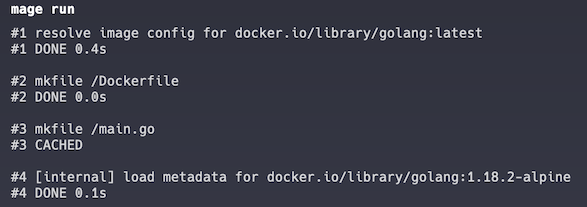
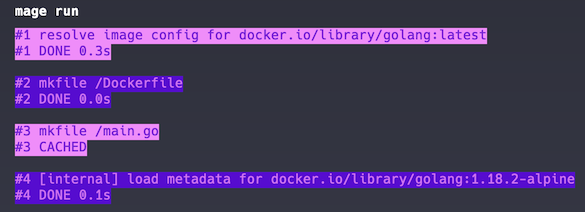

# dagger-logger

Provides stylized logging for Dagger

This logger uses [charmbracelet/lipgloss](https://github.com/charmbracelet/lipgloss) under the hood to give alternating colors for Dagger output. Any ANSI 16, ANSI256, or True Color can be passed as the Light/Dark color options.

With plain logging:

```go
dagger.Connect(ctx, dagger.WithLogOutput(os.Stdout))
```



With stylized logging:

```go
logger := log.Logger{
	Light: "213",
	Dark:  "56",
}
client, err := dagger.Connect(ctx, dagger.WithLogOutput(logger))
```



